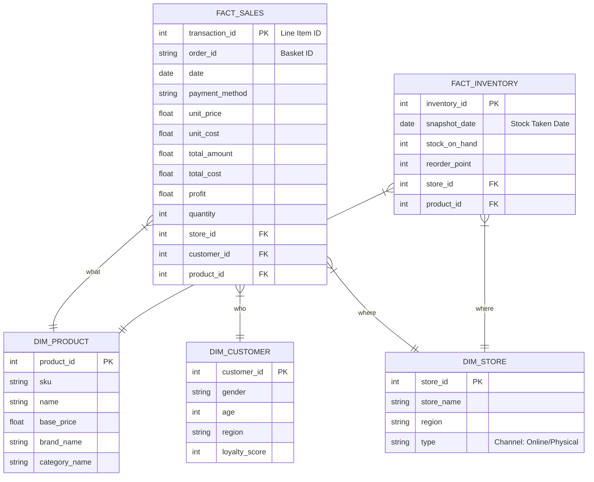

# 📖 Kamus Data & Arsitektur Schema (Retail Dashboard)

Dokumen ini menjelaskan struktur data (Schema) yang digunakan dalam proyek Retail Dashboard. Gunakan panduan ini untuk memahami bagaimana tabel saling berhubungan saat membuat visualisasi di Power BI, Tableau, atau Streamlit.

---

## 1. Arsitektur Data (Star Schema)

Kita menggunakan **Star Schema**.
*   **Tengah (Fact)**: Berisi angka transaksi (Penjualan, Stok).
*   **Pinggir (Dimension)**: Berisi detail "Siapa", "Apa", "Di mana", "Kapan".

---

## 2. Detail Tabel & Contoh Data

### A. Tabel Fakta (Fact Tables)

#### 1. `fact_sales` (Tabel Transaksi Utama)
*   **Grain**: 1 Baris = 1 Produk dalam 1 Order (**Line Item**).
*   **Market Basket Analysis**: Gunakan `order_id` untuk mengelompokkan item yang dibeli bersamaan.
*   **Formula Profit**: `profit = total_amount - total_cost` (dimana `total_cost = unit_cost * quantity`).
*   **Channel**: Ditentukan oleh `dim_store.type` (Online vs Physical).

| transaction_id | order_id      | date       | store_id | product_id | quantity | unit_price | total_amount | unit_cost | total_cost | profit | payment_method |
|:-------------- |:------------- |:---------- |:-------- |:---------- |:-------- |:---------- |:------------ |:--------- |:---------- |:------ |:-------------- |
| 1001           | ORD-A1B2      | 2024-11-01 | 1        | 23         | 2        | 22.50      | 45.00        | 10.00     | 20.00      | 25.00  | Credit Card    |
| 1002           | ORD-A1B2      | 2024-11-01 | 1        | 88         | 1        | 50.00      | 50.00        | 20.00     | 20.00      | 30.00  | Credit Card    |
| 1003           | ORD-C3D4      | 2024-11-02 | 2        | 120        | 1        | 22.50      | 22.50        | 12.00     | 12.00      | 10.50  | Debit Card     |

*Catatan: `unit_cost` dihitung dari `base_price` * (1 - margin), tidak terpengaruh diskon promosi.*

#### 2. `fact_inventory` (Tabel Stok)
*   **Jenis Data**: Historical Snapshots (Monthly + Current).
*   **Grain**: 1 Baris = Stok 1 Produk di 1 Toko pada tanggal `snapshot_date`.
*   **Volume**: Mencakup snapshot bulanan (tgl 1 setiap bulan) dan snapshot hari ini untuk analisis tren.

| inventory_id | snapshot_date | store_id | product_id | stock_on_hand | reorder_point | last_restock_date |
|:------------ |:------------- |:-------- |:---------- |:------------- |:------------- |:----------------- |
| 501          | 2024-01-01    | 1        | 23         | 100           | 20            | 2023-12-20        |
| 502          | 2024-02-01    | 1        | 23         | 95            | 20            | 2024-01-25        |
| ...          | ...           | ...      | ...        | ...           | ...           | ...               |
| 590          | **Today**     | 1        | 23         | 150           | 20            | 2024-10-25        |

---

### B. Tabel Dimensi (Dimensions)

#### 1. `dim_product` (Katalog Produk)
Detail lengkap mengenai produk yang dijual.

| product_id | name                          | sku       | brand_id | category_id | base_price | description_clean   |
|:---------- |:----------------------------- |:--------- |:-------- |:----------- |:---------- |:------------------- |
| 23         | Nike Sportswear T-Shirt White | NIK-001-W | 10       | 5           | 22.50      | 100% Cotton t-shirt |
| 105        | Dr Martens 1460 Boots         | DRM-1460  | 8        | 9           | 120.00     | Leather boots black |

#### 2. `dim_customer` (Pelanggan)
Siapa yang membeli? Digunakan untuk segmentasi.

| customer_id | gender | age | region     | join_date  | loyalty_score |
|:----------- |:------ |:--- |:---------- |:---------- |:------------- |
| 501         | Male   | 28  | London     | 2023-01-15 | 85            |
| 892         | Female | 34  | Manchester | 2023-05-20 | 120           |

#### 3. `dim_store` (Toko & Channel)
Di mana transaksi terjadi? Kolom `type` membedakan channel Online vs Offline.

| store_id | store_name              | region        | type       |
|:-------- |:----------------------- |:------------- |:---------- |
| 1        | ASOS Online             | Global        | **Online** |
| 2        | Oxford Street Flagship  | London        | **Physical** |
| 3        | Manchester Arndale      | North West    | **Physical** |

---

## 3. Data Governance & Quality Rules

Untuk menjaga standar "Enterprise Ready", dataset ini mengikuti aturan berikut:

1.  **Primary Keys**: Setiap tabel memiliki ID unik (`transaction_id`, `product_id`, dll) yang tidak boleh duplikat.
2.  **Referential Integrity**: Semua ID di tabel Fact (`product_id`, `store_id`) **WAJIB** ada di tabel Dimension pasangannya. Tidak ada transaksi "Orphan".
3.  **Missing Values**:
    *   `profit` dan `total_amount` tidak boleh NULL.
4.  **Handling Duplicate**: Jika ada order ulang dengan `transaction_id` sama, sistem ETL akan me-reject atau melakukan update (Upsert).

---

## 4. Tips Membuat Visualisasi

1.  **Average Order Value (AOV)**
    *   Salah: `Average(total_amount)` (Ini adalah rata-rata harga per item!).
    *   Benar: `Sum(total_amount) / DistinctCount(order_id)`.

2.  **Margin Analysis**
    *   Margin % = `Sum(profit) / Sum(total_amount)`.
    *   Gunakan `unit_cost` untuk melihat dampak diskon terhadap profitabilitas (apakah promo masih untung?).
