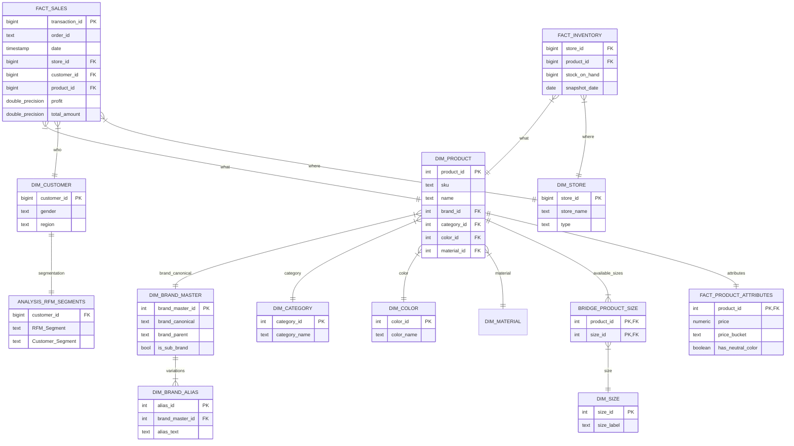

#  Kamus Data & Arsitektur Schema (Retail Dashboard)

Dokumen ini menjelaskan struktur data (Schema) yang digunakan dalam proyek Retail Dashboard. Gunakan panduan ini untuk memahami bagaimana tabel saling berhubungan saat membuat visualisasi di Power BI, Tableau, atau Streamlit.

---

## 1. Arsitektur Data (Star Schema & Snowflake)

Kita menggunakan **Hybrid Schema** (kombinasi Star dan Snowflake).
*   **Tengah (Fact)**: Berisi angka transaksi (Penjualan, Stok) dan atribut produk.
*   **Pinggir (Dimension)**: Berisi detail "Siapa", "Apa", "Di mana", "Kapan". Beberapa dimensi dinormalisasi (Snowflake) untuk efisiensi penyimpanan dan integritas data (mis: Brand, Category, Size terpisah).

---

## 2. Detail Tabel & Contoh Data

### A. Tabel Fakta (Fact Tables)

#### 1. `fact_sales` (Tabel Transaksi Utama)
Berisi data transaksi penjualan historis.
*   **Grain**: 1 Baris = 1 Item dalam 1 Order.

| Kolom | Tipe Data | Deskripsi |
|:----- |:--------- |:--------- |
| `transaction_id` | `bigint` | Primary Key. ID unik transaksi per baris item. |
| `order_id` | `text` | ID Pesanan (bisa berulang jika 1 order punya banyak item). |
| `date` | `timestamp` | Tanggal dan waktu transaksi. |
| `store_id` | `bigint` | FK ke `dim_store`. |
| `product_id` | `bigint` | FK ke `dim_product`. |
| `customer_id` | `bigint` | FK ke `dim_customer`. |
| `quantity` | `bigint` | Jumlah barang yang dibeli. |
| `unit_price` | `double` | Harga satuan saat transaksi terjadi. |
| `total_amount` | `double` | Total penjualan (`quantity` * `unit_price`). |
| `unit_cost` | `double` | Modal satuan barang. |
| `total_cost` | `double` | Total modal (`quantity` * `unit_cost`). |
| `profit` | `double` | Keuntungan (`total_amount` - `total_cost`). |
| `payment_method` | `text` | Metode pembayaran (Credit Card, Paypal, dll). |

#### 2. `fact_inventory` (Tabel Stok)
Snapshot stok harian/bulanan di setiap toko.

| Kolom | Tipe Data | Deskripsi |
|:----- |:--------- |:--------- |
| `snapshot_date` | `date` | Tanggal pencatatan stok. |
| `store_id` | `bigint` | FK ke `dim_store`. |
| `product_id` | `bigint` | FK ke `dim_product`. |
| `stock_on_hand` | `bigint` | Jumlah stok fisik tersedia. |
| `reorder_point` | `bigint` | Batas minimal stok sebelum harus restock. |
| `last_restock_date`| `timestamp`| Kapan terakhir barang masuk. |

#### 3. `fact_product_attributes` (Atribut Analitik Produk)
Tabel turunan (derived) yang berisi pre-calculated attributes untuk analisis produk. Relation 1-to-1 dengan `dim_product`.

| Kolom | Tipe Data | Deskripsi |
|:----- |:--------- |:--------- |
| `product_id` | `int` | PK, FK ke `dim_product`. |
| `price_bucket` | `text` | Kategori harga (Low, Mid, High, Luxury) berdasarkan distribusi data. |
| `desc_length_chars`| `int` | Panjang deskripsi produk (untuk analisis korelasi dengan sales). |
| `num_sizes` | `int` | Jumlah varian ukuran yang tersedia untuk produk ini. |
| `has_neutral_color`| `boolean` | Flag apakah produk berwarna netral (Hitam, Putih, Abu). |
| `is_premium_brand` | `boolean` | Flag apakah ini brand premium (Top 25% by avg price). |

#### 4. `fact_product_features` (Data Science Features)
Fitur hasil engineering untuk model Machine Learning atau Clustering.

| Kolom | Tipe Data | Deskripsi |
|:----- |:--------- |:--------- |
| `product_id` | `bigint` | PK. |
| `price_zscore` | `double` | Harga terstandarisasi (Z-Score) relatif terhadap kategori. |
| `cluster_id` | `int` | ID kelompok hasil K-Means Clustering produk. |

---

### B. Tabel Dimensi (Dimensions)

#### 1. `dim_product` (Produk Inti)
Tabel utama produk yang ter-normalisasi (Snowflake schema).

| Kolom | Tipe Data | Deskripsi |
|:----- |:--------- |:--------- |
| `product_id` | `int` | Primary Key. |
| `sku` | `text` | Stock Keeping Unit (Unique Code). |
| `name` | `text` | Nama Produk. |
| `url` | `text` | Link ke halaman produk di website ASOS. |
| `brand_master_id` | `int` | FK ke `brand_master` (Canonical Brand). |
| `brand_id` | `int` | FK ke `dim_brand` (Legacy/Raw Brand). |
| `category_id` | `int` | FK ke `dim_category`. |
| `color_id` | `int` | FK ke `dim_color` (Warna utama). |
| `base_price` | `numeric` | Harga dasar (sebelum diskon). |

#### 2. Dimensi Pendukung (Lookup Tables)
Tabel kecil untuk normalisasi, menghindari repetisi teks.

*   **`brand_master`**: `brand_master_id`, `brand_canonical` (Official Name), `brand_parent` (Parent Company).
*   **`brand_alias`**: `alias_id`, `brand_master_id`, `alias_text` (Variations/Misspellings mapped to master).
*   **`dim_brand`** (Legacy): Raw extracted brand names.
*   **`dim_category`**: `category_id`, `category_name`, `category_group` (Contoh: Men's Shoes, Accessories).
*   **`dim_color`**: `color_id`, `color_name` (Warna spesifik), `color_family` (Pengelompokan warna).
*   **`dim_size`**: `size_id`, `size_label` (S, M, L, UK 8, dll), `region` (UK/US/EU), `size_numeric`.
*   **`dim_material`**: `material_id`, `material_desc` (Full komposisi), `material_main` (Bahan utama mis: Cotton).

#### 3. `bridge_product_size` (Ketersediaan Ukuran)
Tabel penghubung Many-to-Many antara Produk dan Size.
*   Jika Produk A tersedia dalam ukuran S, M, L -> akan ada 3 baris di tabel ini.

#### 4. `dim_customer`
Detail pelanggan.

| Kolom | Tipe Data | Deskripsi |
|:----- |:--------- |:--------- |
| `customer_id` | `bigint` | PK. |
| `gender` | `text` | Jenis kelamin. |
| `age` | `bigint` | Usia. |
| `region` | `text` | Wilayah domisili. |
| `loyalty_score` | `bigint` | Skor loyalitas membership. |

#### 5. `dim_store`
Profil toko atau channel penjualan.

| Kolom | Tipe Data | Deskripsi |
|:----- |:--------- |:--------- |
| `store_id` | `bigint` | PK. |
| `store_name` | `text` | Nama toko. |
| `type` | `text` | 'Online' atau 'Physical'. |

#### 6. `dim_image`
Menyimpan URL gambar produk. Satu produk bisa memiliki banyak gambar (Relation 1-to-Many).

---

### C. Tabel Analisis & Staging

#### 1. `analysis_rfm_segments`
Hasil analisis segmentasi customer menggunakan metode RFM (Recency, Frequency, Monetary).

| Kolom | Tipe Data | Deskripsi |
|:----- |:--------- |:--------- |
| `customer_id` | `bigint` | FK ke `dim_customer`. |
| `Recency` | `bigint` | Hari sejak pembelian terakhir. |
| `Frequency` | `bigint` | Total jumlah transaksi. |
| `Monetary` | `double` | Total uang yang dibelanjakan. |
| `RFM_Segment` | `text` | Kombinasi skor (mis: "311"). |
| `Customer_Segment` | `text` | Label segmen (mis: "VIP", "New Customer", "Lost"). |

#### 2. `stg_asos_raw`
Tabel penampungan data mentah (Staging Area) dari hasil scraping sebelum proses transformasi (ETL) dimulai. Struktur tidak beraturan, banyak kolom `TEXT` yang belum di-cleaning.

---

## 3. Data Governance

1.  **Integritas Data**:
    *   Relasi Produk ke Brand/Category/Color **WAJIB** ada (Not Null Foreign Keys di `dim_product`).
2.  **Struktur Harga**:
    *   `base_price` di `dim_product` adalah harga katalog.
    *   `unit_price` di `fact_sales` adalah harga aktual saat transaksi (bisa lebih rendah jika diskon).
3.  **Mata Uang**:
    *   Semua nilai moneter (`price`, `cost`, `proft`) dalam **GBP (£)** (Pound Sterling) kecuali dinyatakan lain.
