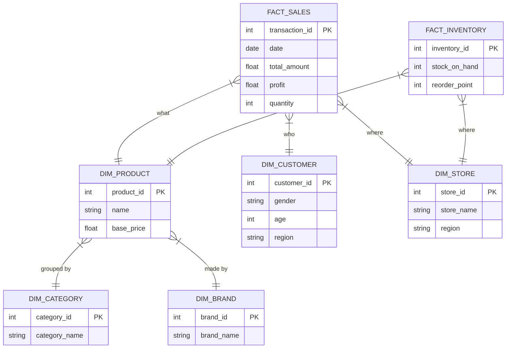

# 📖 Kamus Data & Arsitektur Schema (Retail Dashboard)

Dokumen ini menjelaskan struktur data (Schema) yang digunakan dalam proyek Retail Dashboard. Gunakan panduan ini untuk memahami bagaimana tabel saling berhubungan saat membuat visualisasi di Power BI, Tableau, atau Streamlit.

---

## 1. Arsitektur Data (Star Schema)

Kita menggunakan **Star Schema**.
*   **Tengah (Fact)**: Berisi angka transaksi (Penjualan, Stok).
*   **Pinggir (Dimension)**: Berisi detail "Siapa", "Apa", "Di mana", "Kapan".

---

## 2. Detail Tabel & Contoh Data

Berikut adalah penjelasan setiap tabel beserta **5 Baris Contoh Data** agar Anda mudah membayangkannya.

### A. Tabel Fakta (Fact Tables)

#### 1. `fact_sales` (Tabel Transaksi Utama)
Mencatat setiap pembelian yang terjadi.
*   **Kegunaan**: Menghitung Revenue, Profit, AOV, Sales Trend.

| transaction_id | date       | time     | store_id | customer_id | product_id | quantity | total_amount | profit | payment_method |
|:-------------- |:---------- |:-------- |:-------- |:----------- |:---------- |:-------- |:------------ |:------ |:-------------- |
| 1001           | 2024-11-01 | 14:30:00 | 1        | 501         | 23         | 2        | £45.00       | £15.00 | Credit Card    |
| 1002           | 2024-11-01 | 15:45:00 | 3        | 892         | 105        | 1        | £120.00      | £40.00 | PayPal         |
| 1003           | 2024-11-02 | 10:15:00 | 2        | 120         | 23         | 1        | £22.50       | £7.50  | Debit Card     |
| 1004           | 2024-11-02 | 11:00:00 | 1        | 55          | 88         | 5        | £250.00      | £80.00 | Klarna         |
| 1005           | 2024-11-03 | 09:20:00 | 4        | 330         | 12         | 1        | £35.00       | £10.00 | Apple Pay      |

#### 2. `fact_inventory` (Tabel Stok)
Mencatat status stok produk di setiap toko saat ini.
*   **Kegunaan**: Cek ketersediaan barang dan deteksi stok menipis (Low Stock Alert).

| inventory_id | store_id | product_id | stock_on_hand | reorder_point | last_restock_date |
|:------------ |:-------- |:---------- |:------------- |:------------- |:----------------- |
| 501          | 1        | 23         | 150           | 20            | 2024-10-25        |
| 502          | 1        | 105        | **3**         | 10            | 2024-09-10        |
| 503          | 2        | 23         | 45            | 15            | 2024-10-28        |
| 504          | 2        | 88         | 200           | 50            | 2024-11-01        |
| 505          | 3        | 12         | 0             | 5             | 2024-08-15        |

---

### B. Tabel Dimensi (Dimensions)

#### 1. `dim_product` (Katalog Produk)
Detail lengkap mengenai produk yang dijual.

| product_id | name                          | sku       | brand_id | category_id | base_price | description_clean   |
|:---------- |:----------------------------- |:--------- |:-------- |:----------- |:---------- |:------------------- |
| 23         | Nike Sportswear T-Shirt White | NIK-001-W | 10       | 5           | £22.50     | 100% Cotton t-shirt |
| 105        | Dr Martens 1460 Boots         | DRM-1460  | 8        | 9           | £120.00    | Leather boots black |
| 88         | Adidas Originals Track Pants  | ADI-TRK   | 12       | 5           | £50.00     | 3-stripes pants     |
| 12         | ASOS Design Skinny Jeans      | ASO-JEAN  | 1        | 3           | £35.00     | Stretch denim       |

#### 2. `dim_customer` (Pelanggan)
Siapa yang membeli? Digunakan untuk segmentasi.

| customer_id | gender | age | region     | join_date  | loyalty_score |
|:----------- |:------ |:--- |:---------- |:---------- |:------------- |
| 501         | Male   | 28  | London     | 2023-01-15 | 85            |
| 892         | Female | 34  | Manchester | 2023-05-20 | 120           |
| 120         | Female | 22  | Scotland   | 2024-02-10 | 40            |
| 55          | Male   | 45  | London     | 2022-11-05 | 200           |

#### 3. `dim_store` (Toko)
Di mana transaksi terjadi?

| store_id | store_name              | region        | type     |
|:-------- |:----------------------- |:------------- |:-------- |
| 1        | ASOS Online             | Global        | Online   |
| 2        | Oxford Street Flagship  | London        | Physical |
| 3        | Manchester Arndale      | North West    | Physical |
| 4        | Birmingham Bullring     | West Midlands | Physical |

---

## 3. Tips Membuat Visualisasi

Saat Anda membuka Power BI atau Tableau, gunakan panduan kolom ini:

1.  **Total Penjualan (Revenue)**
    *   Ambil **Sum** dari `fact_sales.total_amount`.

2.  **Produk Paling Laris**
    *   Ambil `dim_product.name` (Axis).
    *   Ambil **Sum** dari `fact_sales.quantity` (Values).

3.  **Customer Distribution**
    *   Ambil `dim_customer.gender` atau `dim_customer.region` (Legend).
    *   Ambil **Count Distinct** dari `fact_sales.customer_id` (Values).

4.  **Low Stock Alert (Barang mau habis)**
    *   Filter: `fact_inventory.stock_on_hand` <= `fact_inventory.reorder_point`.
    *   Tampilkan tabel: `dim_store.store_name`, `dim_product.name`, `fact_inventory.stock_on_hand`.

---
*Dokumen ini dibuat otomatis untuk membantu pemahaman schema dataset Retail Dashboard.*
